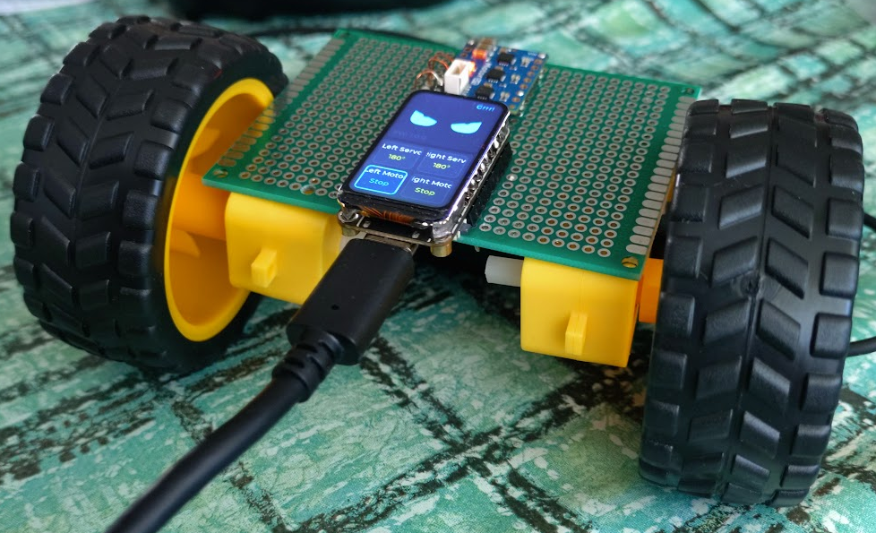

# Little Walker

ESP32-C6 firmware for a small two-wheeled robot. It drives **two DC motors**
(via a Pololu **Motoron M3T453** triple I2C motor controller) and **two hobby
servos** (on-chip LEDC/PWM), reacts to a **VL53L1X** lidar and an **LSM303AGR**
accelerometer/magnetometer, and shows live status on the on-board 1.47" LCD.



The build above uses:

- **Waveshare** ESP32-C6-LCD-1.47 development board (MCU + display)
- **Pololu** Motoron M3T453 triple I2C motor controller
- 2x geared DC motors with 65 mm wheels
- A green prototyping/perfboard as the chassis and wiring base

See [Components](#components) for full specifications.

The display is split in two halves:

- **Top (~50%): an animated robot face** — two half-height eyes that change
  expression as the robot behaves (see [Robot face](#robot-face)).
- **Bottom (~50%): a 2x2 grid of status tiles** (Left Servo, Right Servo, Left
  Motor, Right Motor), highlighting the active one in blue, with a **sensor
  readout strip** beneath it (lidar distance, accelerometer, magnetometer). The
  firmware version is shown dimly in the face panel's corner.

The whole UI is rotated 180° (the ST7789 is mounted `mirror_x`/`mirror_y`) so the
board can sit inverted on the chassis.

### Reactive behaviour

The robot runs a small sense-act loop (`behave_task` in `main/main.c`) instead of
a fixed script:

```
             +-------------------+
             |  read lidar (mm)  |
             +-------------------+
                       |
        distance > 200 mm? --------- no ---------+
                       | yes                     |
              drive both wheels FWD       stop, LOOK left/right
                       |                  (sweep servos 20/160)
          accel jitter >= threshold?             |
             |                 |          turn toward the
            yes                no          more-open side,
          keep rolling      "STUCK":       then re-check
          (happy face)     stop + furious  (sad -> surprise)
```

- **Walk toward open space:** while the lidar reads more than `LIDAR_STOP_MM`
  (200 mm) ahead, both wheels drive forward.
- **Look left and right:** when something comes within 200 mm, the robot stops,
  sweeps the servos to ~20° and ~160° while sampling the lidar, then turns in
  place toward whichever side is more open until the path reopens past
  `LIDAR_CLEAR_MM` (300 mm).
- **Wheel-motion check:** while driving forward it watches accelerometer
  "jitter"; if the wheels are commanded to move but the accel stays too still
  (below `STALL_G_THRESH`), it flags `STUCK`, stops, and shows the furious face.
  The measured jitter is logged each forward burst so the threshold is easy to
  tune for your surface.

Thresholds are `#define`s at the top of `main/main.c`.

## Hardware

| Item                 | Detail                                                   |
| -------------------- | -------------------------------------------------------- |
| MCU board            | Waveshare **ESP32-C6-LCD-1.47** (172x320 ST7789)         |
| Motor controller     | Pololu **Motoron M3T453** (triple, I2C, addr `16`/`0x10`)|
| Motors               | 2x brushed DC motors (4.5–44 V, <= 0.8 A continuous)     |
| Servos               | 2x standard hobby servos (5 V)                           |
| Distance sensor      | **VL53L1X** ToF lidar, Qwiic, I2C addr `0x29`            |
| IMU / compass        | **LSM303AGR** accel+mag, Qwiic, I2C addr `0x19`/`0x1E`   |
| Logic supply         | USB supply, selectable **3.3 V / 5 V**                   |
| Motor supply         | USB supply, **0–24 V** adjustable                        |
| Build base           | Breadboard with two power rails                          |

## Pin map (ESP32-C6)

| Function          | GPIO   | Notes                                  |
| ----------------- | ------ | -------------------------------------- |
| LCD MOSI / SCLK   | 6 / 7  | on-board display (do not reuse)        |
| LCD CS/DC/RST/BL  | 14/15/21/22 | on-board display                  |
| Servo LEFT signal | 0      | PWM 50 Hz                              |
| Servo RIGHT signal| 1      | PWM 50 Hz                              |
| I2C SDA           | 4      | to Motoron SDA + Qwiic chain           |
| I2C SCL           | 5      | to Motoron SCL + Qwiic chain           |

> The I2C pins (GPIO4/5) are defined at the top of `main/main.c`
> (`PIN_I2C_SDA` / `PIN_I2C_SCL`). Confirm they match a free pad on your board's
> header silkscreen and change them there if needed.

### Qwiic sensor chain (shared I2C bus)

The **VL53L1X** lidar and **LSM303AGR** accel/magnetometer are daisy-chained over
Qwiic onto the **same GPIO4/5 I2C bus** as the Motoron (all 3.3 V logic). The
addresses do not collide:

| Device            | I2C addr        | Product                                                                                                   |
| ----------------- | --------------- | -------------------------------------------------------------------------------------------------------- |
| Motoron M3T453    | `0x10`          | motor controller                                                                                          |
| LSM303AGR         | `0x19` + `0x1E` | [Electrokit 41035585](https://www.electrokit.com/rorelsegivare-och-magnetometer-lsm303agr-qwiic) / [Adafruit 4413](https://www.adafruit.com/product/4413) |
| VL53L1X           | `0x29`          | [Electrokit 41036424](https://www.electrokit.com/avstandssensor-tof-lidar-30-4000mm-vl53l1x-qwiic)        |

The startup I2C scan names each device it finds. Live lidar distance (mm),
accelerometer (g), and magnetometer (µT) readings are shown on the LCD in a strip
below the servo/motor tiles, refreshed ~10 Hz. A missing sensor simply shows `--`
and does not stop the motor demo.

## Wiring overview

```
                    +5V rail            +3.3V rail            0-24V rail
                    (servo V+)          (logic VDD)           (motor VIN)
   USB PSU #2          |                    |                     |
  [3.3V / 5V] ---------+--------------------+                     |
   (set 5V out for     |                    |                     |
    servos; 3.3V out   |                    |                     |
    for logic)*        |                    |          USB PSU #1 |
                       |                    |          [0-24V] ---+
                       |                    |                     |
  =========================== COMMON GND RAIL ==========================
        |          |                |               |             |
        |          |                |               |             |
   ESP32-C6     Servo L          Servo R         Motoron        Motors
    GND          GND              GND             GND           (via M1/M2)


  ESP32-C6-LCD-1.47                         Motoron M3T453
  +-----------------+                       +--------------------+
  | GPIO0  (Servo L)|---------> Servo L sig | SDA  <----------+  |
  | GPIO1  (Servo R)|---------> Servo R sig | SCL  <--------+ |  |
  | GPIO4  (SDA)    |----------------------)| VDD  <------+ | |  |
  | GPIO5  (SCL)    |--------------------+ )| GND         | | |  |
  | 3V3             |------------------+ | )|             | | |  |
  | GND             |----------------+ | | )| VIN  <--- 0-24V    |
  +-----------------+                | | | (| M1A/M1B --> Motor L |
                                     | | | (| M2A/M2B --> Motor R |
        common GND <-----------------+ | | (+--------------------+
        ESP 3V3 ----> Motoron VDD ------+ | (
        GPIO5  ------> Motoron SCL --------+ (
        GPIO4  ------> Motoron SDA ----------+

  * The selectable USB PSU provides ONE voltage at a time. Use a unit with two
    independent outputs, OR feed logic (3.3 V) and servos (5 V) from separate
    regulated outputs. If you only have a single 5 V output available, power the
    ESP32-C6 over its USB-C port instead and use the PSU's 5 V only for servos.
```

### Servo connections (x2)

```
   Servo connector            ESP32-C6 / rails
   +-----------+
   | SIG  -----|-----------> GPIO0 (Left) / GPIO1 (Right)
   | V+   -----|-----------> +5V rail
   | GND  -----|-----------> COMMON GND rail
   +-----------+
```

### Motoron M3T453 connections

```
   Logic side (to ESP32-C6, 3.3 V)        Power / motor side
   +-------------------------+            +-------------------------+
   | VDD  <--- 3V3 (ESP32)   |            | VIN  <--- 0-24V (+)      |
   | GND  <--- COMMON GND    |            | GND  <--- COMMON GND     |
   | SDA  <--> GPIO4         |            | M1A/M1B --> Left Motor   |
   | SCL  <--> GPIO5         |            | M2A/M2B --> Right Motor  |
   +-------------------------+            | M3A/M3B --> (unused)     |
                                          +-------------------------+
   - Default 7-bit I2C address: 16 (0x10).
   - On-board 10k pull-ups on SDA/SCL tie to VDD (3.3 V) — no external
     pull-ups needed.
   - VDD logic range 3.0–5.5 V; VIN motor range 4.5–44 V.
```

## Power notes

- **Two USB power supplies on a breadboard:**
  - **PSU #1 (0–24 V):** feeds the Motoron **VIN** (motor power). Set it to your
    motors' rated voltage. Its negative output joins the common ground rail.
  - **PSU #2 (selectable 3.3 V / 5 V):** provides logic power. The ESP32-C6 runs
    at **3.3 V** and the Motoron **VDD** is also **3.3 V** (so the I2C levels
    match). Hobby servos want **5 V**.
- **Common ground is mandatory:** all grounds — ESP32-C6 GND, Motoron GND,
  both PSU negatives, servo grounds — must be tied to a single ground rail.
  Without it, I2C and PWM signals have no reference and nothing works.
- **Do not** power the servos or motor VIN from the ESP32-C6 3.3 V pin; it
  cannot supply that current.
- Keep motor (VIN) wiring on its own rail away from the logic rail; only the
  ground is shared.

## Robot face

The top panel renders two cyan rounded-rect eyes. Each eye is carved by two
background-coloured "eyelids" (top + bottom) that resize/rotate to form an
expression; some expressions also show a small text cue and a round black pupil.

| Expression | Eyes                              | Pupil | Text cue |
| ---------- | --------------------------------- | ----- | -------- |
| `sleep`    | thin bottom slit                  | no    | `z Z z`  |
| `surprise` | wide open                         | yes   | —        |
| `idle`     | short, centred band               | yes   | —        |
| `sad`      | slanted `/ \` (inner corners up)  | no    | —        |
| `happy`    | upward dome                       | no    | `Ahah`   |
| `furious`  | slanted `\ /` (inner corners down)| no    | `Grrr!`  |

The current expression is also printed to the serial log (`Expression: <name>`).
`behave_task` maps a face to each behaviour: `happy` while driving forward,
`surprise` when an obstacle is detected within 200 mm, `sad` while scanning and
turning, and `furious` when the wheels appear stuck.

## Firmware behaviour

On boot the firmware:

1. Initializes the two servo PWM channels (centered at 90 deg).
2. Initializes the Motoron over I2C: `Reinitialize`, `Disable CRC`,
   `Clear reset flag`, and clears the Error mask so the 1.5 s command-timeout
   does not stop the motors during the servo phases.
3. Probes the Qwiic sensors (VL53L1X lidar, LSM303AGR accel/mag) on the same I2C
   bus; any that are missing are skipped and shown as `--`.
4. Brings up the LCD + LVGL (rotated 180°) and draws the robot face (top), the
   2x2 status grid, and the sensor readout strip (bottom).
5. Runs `sensor_task` (lidar/accel/mag readout ~10 Hz) and `behave_task` (the
   reactive sense-act loop described in [Reactive behaviour](#reactive-behaviour)).

Motor speed is set by `MOTOR_SPEED` in `main/main.c` (0–800; default 400 for
gentle motion). Forward = `+MOTOR_SPEED`, Back = `-MOTOR_SPEED`, Stop = `0`.

## Build & flash

```bash
idf.py set-target esp32c6
idf.py build
idf.py -p /dev/ttyACM0 flash monitor
```

## Example boot log

On a correctly wired board the startup I2C scan names every device on the bus and
the reactive behaviour loop starts:

```
I (352) main: Scanning I2C bus (SDA=GPIO4 SCL=GPIO5)...
I (352) main:   found I2C device at 0x10 (16) - Motoron M3T453
I (357) main:   found I2C device at 0x19 (25) - LSM303AGR accel
I (362) main:   found I2C device at 0x1E (30) - LSM303AGR mag
I (368) main:   found I2C device at 0x29 (41) - VL53L1X lidar
I (390) main: Motoron initialized on I2C SDA=GPIO4 SCL=GPIO5 addr=16
I (405) vl53l1x: VL53L1X ranging started at 0x29
I (405) main: Sensors: lidar=1 accel=1 mag=1
I (661) main: UI ready. Starting reactive behaviour...
I (670) main: Obstacle at 154 mm - scanning
I (1680) main: Scan L=160 R=158 -> turn left
I (3532) main: Rolling: dist=812 mm jitter=0.061 g
```

If the scan instead prints `no I2C devices found` or `Motoron NOT found at
address 16`, check the Motoron VDD/GND/SDA/SCL wiring, the common ground, and
that the controller is using its default address (16).

## Components

### Waveshare ESP32-C6-LCD-1.47

Waveshare ESP32-C6 development board with an integrated 1.47" TFT-LCD display.
The board is suitable for IoT projects, dashboards, and other applications that
need a graphical user interface. It supports **LVGL** (Light and Versatile
Graphics Library), an open-source library for building custom GUIs that also
handles input devices such as a mouse, buttons, etc.

| Spec            | Detail                                                              |
| --------------- | ------------------------------------------------------------------- |
| MCU             | ESP32-C6FH4 — 32-bit RISC-V, 160 MHz                                |
| SRAM            | 512 kB HP + 16 kB LP SRAM                                           |
| ROM             | 320 kB                                                              |
| Flash           | 4 MB                                                                |
| Wireless        | 2.4 GHz Wi-Fi 6 (802.11 b/g/n/ax) and Bluetooth 5 (LE)             |
| Antenna         | Integrated                                                          |
| Display         | 1.47" TFT-LCD, 172 × 320 px, 262k colors, SPI interface            |
| Connection      | USB-C port for power and programming                                |
| GPIO            | 2× 9-pin headers (not pre-soldered): 13 GPIOs with UART, I²C, PWM, 6 ADC channels, plus 5 V / 3.3 V / GND |
| Card slot       | MicroSD (offline image/data storage)                                |
| Buttons         | Reset and Boot                                                      |
| Dimensions      | approx. 36.4 × 20.3 mm                                              |
| Dev environments| ESP-IDF, Arduino IDE, CircuitPython                                 |
| Model           | Waveshare ESP32-C6-LCD-1.47                                         |

### Pololu Motoron M3T453 Triple I²C Motor Controller

An I²C-controlled motor controller for up to three DC motors. Each motor is
controlled independently, and multiple Motoron controllers can share the same
I²C bus for systems with more motors. Supplied without pin headers.

| Spec                     | Detail                                       |
| ------------------------ | -------------------------------------------- |
| Product                  | Motoron M3T453 Triple I2C Motor Controller   |
| Motors                   | Up to 3 DC motors                            |
| Interface                | I2C                                          |
| I2C clock frequency      | Up to 400 kHz                                |
| Motor voltage            | 4.5 to 44 V                                  |
| Current rating           | 0.8 A continuous per motor                   |
| Peak current             | 2 A per motor for < 1 s                      |
| Logic voltage            | 3.0 to 5.5 V                                 |
| PWM frequency            | 1 to 80 kHz                                  |
| Current sensing          | Motor channels 1 and 2                       |
| Reverse voltage protection| Down to −40 V on motor power supply         |
| Connections              | 2.54 mm pitch                                |
| Pin headers              | Not included                                 |
| Dimensions               | 17.8 × 22.9 mm                               |

### Geared DC motors with wheels (x2)

| Spec               | Detail                                              |
| ------------------ | --------------------------------------------------- |
| Supply voltage     | 3–9 V DC (optimal approx. 5 V)                      |
| Current (no-load)  | 160–200 mA depending on supply voltage              |
| Speed (no-load)    | 90–300 rpm (±10 %) depending on supply voltage      |
| Torque             | 800–1200 gf·cm depending on supply voltage          |
| Shaft              | 3.6 mm double shaft with 1.9 mm opening             |
| Wheel diameter     | 65 mm                                               |
| Wheel width        | 27 mm                                               |
| Motor dimensions   | 37.6 × 64.2 × 22.5 mm                               |
| Weight             | approx. 58 g                                        |

### VL53L1X ToF lidar (Qwiic)

Laser Time-of-Flight distance sensor on a Qwiic breakout, wired into the shared
GPIO4/5 I2C bus. [Electrokit 41036424](https://www.electrokit.com/avstandssensor-tof-lidar-30-4000mm-vl53l1x-qwiic).

| Spec            | Detail                        |
| --------------- | ----------------------------- |
| Sensor          | VL53L1X                       |
| Range           | approx. 30 mm to 4000 mm      |
| Update rate     | up to 50 Hz                   |
| Field of view   | 27°                           |
| Interface       | I2C, address `0x29`           |
| Supply / logic  | 3.3–5 V                       |

### LSM303AGR accelerometer + magnetometer (Qwiic)

6-axis IMU (3-axis accelerometer + 3-axis magnetometer) on a Qwiic breakout,
also on the GPIO4/5 I2C bus. [Electrokit 41035585](https://www.electrokit.com/rorelsegivare-och-magnetometer-lsm303agr-qwiic) /
[Adafruit 4413](https://www.adafruit.com/product/4413).

| Spec            | Detail                                   |
| --------------- | ---------------------------------------- |
| Sensor          | LSM303AGR                                |
| Accelerometer   | ±2/±4/±8/±16 g (firmware uses ±2 g)      |
| Magnetometer    | ±50 gauss                                |
| Interface       | I2C, addresses `0x19` (acc) + `0x1E` (mag)|
| Supply / logic  | 3.3–5 V                                  |

### Prototyping/perfboard chassis

The green board the electronics are mounted on is a **prototyping perfboard**
(also called a "perfboard", "protoboard", or solder-able experiment board): an
epoxy/FR-4 board with a grid of 2.54 mm-pitch plated through-holes. Unlike a
solderless breadboard, components and wires are **soldered** to the pads, giving
a permanent, vibration-resistant build — handy here since the board doubles as
the robot chassis carrying the two geared wheels and the USB-C cable. Each hole
is an isolated pad, so all connections between the ESP32-C6, Motoron, motors, and
power are made with soldered wire links on the underside.
