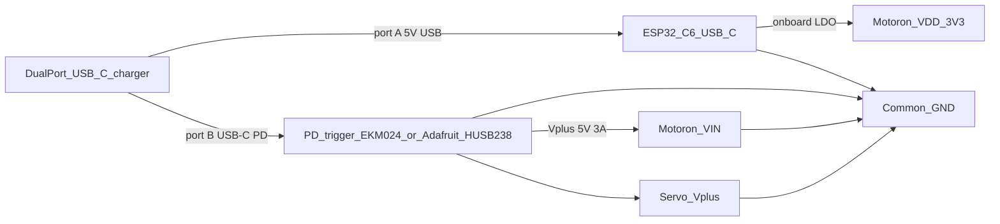
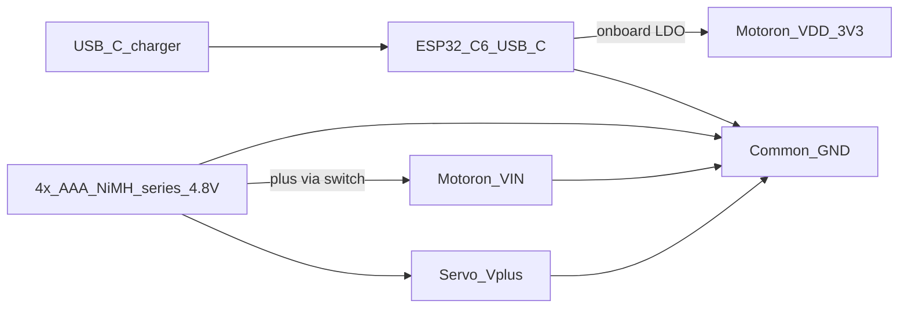
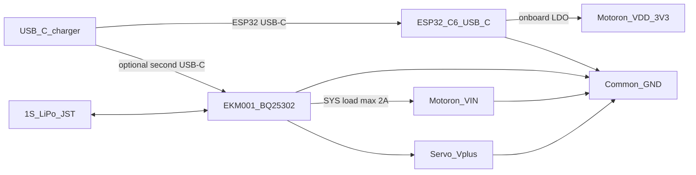

# Powering the motors

The **ESP32-C6-LCD-1.47 always plugs into a USB charger on its own USB-C port** (logic, LCD, programming). Motoron **VDD** still comes from the ESP32 **3V3** pin.

Motoron **VIN** (both Joy-IT COM-Motor01 DC motors) and both servo **V+** rails come from **exactly one** motor-power option at a time. Do **not** parallel two VIN sources. Do **not** power motors or servos from the ESP32 3.3 V pin.

| Rail | Source | Feeds |
| --- | --- | --- |
| USB-C 5 V (ESP32) | Wall charger / power bank → ESP32 USB-C | MCU, LCD, Motoron **VDD** (via 3V3) |
| Motor VIN + servo V+ | Option A, B, or C below | Motoron **VIN**, both servos |
| Common GND | All negatives tied together | ESP32 GND, Motoron GND, servo GND, PD/battery GND |

## Power boards (URLs)

| Board | Role | Buy / docs |
| --- | --- | --- |
| Electrokit **EKM024** USB-C PD trigger 5–20 V | Negotiate 5 V / 3 A from a USB-PD charger for motors + servos | [electrokit.com — PD trigger USB-C 5–20 V](https://www.electrokit.com/en/stromforsorjningskort-pd-trigger-usb-c-5-20v) |
| Adafruit **HUSB238** USB Type C PD Dummy Breakout (PID 5807) | Same job as EKM024 (same HUSB238 chip, different jumpers) | [learn.adafruit.com — HUSB238 guide](https://learn.adafruit.com/adafruit-husb238-usb-type-c-power-delivery-breakout?view=all) · [adafruit.com/product/5807](https://www.adafruit.com/product/5807) |
| Electrokit **EKM001** USB-C Li-Ion/LiPo charger 0.2–2 A (BQ25302) | Charge a **single** 3.6–3.7 V cell; load output ~2 A with power-path | [electrokit.com — LiPo charger 2 A USB-C](https://www.electrokit.com/en/lipo-laddare-2a-usb-c) |

**Do not use a USB-C Y-splitter or passive hub** for PD. Negotiation uses the CC pins; a splitter leaves the trigger at 5 V / low current.

---

## Option A — USB-PD trigger (recommended tethered)

Second charger port must be **USB-PD**. First port (ordinary 5 V USB is fine) feeds the ESP32.

Use **either** Electrokit EKM024 **or** Adafruit HUSB238, not both.



Charger budget with both ports loaded: **≥ ~20 W** (ESP32 ~2.5 W, motors/servos up to ~15 W).

### Electrokit EKM024

- Art. no. **41032583**, HUSB238, PD 3.0.
- Output: **5 / 9 / 12 / 15 / 20 V**, **3 A** if the charger supports 3 A at that voltage.
- Select **5 V** with the jumper. Do **not** use 9–20 V (motors max 9 V; servos are 5 V only).
- Fallback if PD fails: **5 V / 500 mA** — not enough for motors.
- I²C / Qwiic optional; jumpers are enough. Do not wire this I²C unless you add pull-ups and keep logic at 3.3 V.

### Adafruit HUSB238

- Defaults **5 V and 1 A closed**. **1 A is not enough.**
- Keep **5 V** closed. Cut **1 A**; leave **2 A** open to request **3 A**.
- If the charger then outputs the wrong voltage, solder **2 A** and retest.
- I²C address `0x08`, no onboard pull-ups; leave I²C unconnected. Motoron stays at `0x10` on GPIO4/5.

```
  USB-PD charger port B
          |
          | USB-C cable
          v
  +-------------------+     V+ / terminal + -----> Motoron VIN
  | EKM024 or HUSB238 |                     +----> Servo L V+
  | jumpered to 5 V   |                     +----> Servo R V+
  | (3 A request)     |     GND / terminal - -----> COMMON GND
  +-------------------+
```

---

## Option B — four AAA NiMH (HUSB238 / EKM024 removed)

ESP32 stays on USB-C. Unplug the PD trigger. Motor VIN and servo V+ come from **4× AAA 1.2 V NiMH in series** (nominal **4.8 V**).



- 4.8 V matches COM-Motor01 (optimal ~5 V) and hobby servos (classic 4.8 V pack). Motoron VIN minimum is **4.5 V**.
- Fresh cells ~1.4 V × 4 ≈ **5.6 V** (under 9 V motor max). Empty ~1.0 V × 4 ≈ **4.0 V** — **below 4.5 V**; recharge before motors stutter while the ESP32 is still up on USB.
- Switch on pack **+**. Pack **−** must join common GND.
- Never connect this pack to VIN while a PD trigger is also driving VIN.

```
  USB charger ---- USB-C ----> ESP32-C6 (logic only)

  4x AAA NiMH  [+]-switch ----> Motoron VIN + both servo V+
               [-] -----------> COMMON GND
```

---

## Option C — Electrokit 1S LiPo charger (limited)

[USB-C Li-Ion/LiPo charger 0.2–2 A JST](https://www.electrokit.com/en/lipo-laddare-2a-usb-c) — art. no. **41021046**, EKM001, TI **BQ25302**.

This is a **1S** charger (3.6–3.7 V cell, **4.2 V** charge), not a 5–20 V PD trigger.

| Spec | Value |
| --- | --- |
| Cell | Li-Ion / LiPo **1S only** (3.6–3.7 V) |
| Charge | 4.2 V, **0.2–2.0 A** (solder jumpers) |
| Input | USB-C or 4.1–6.2 V |
| Load / SYS | Power-path, up to **~2 A**, auto-switch USB vs battery |
| Battery connector | JST-PH |
| Size | 35 × 20 mm |



**Voltage problem on battery alone:** a 1S pack is **3.0–4.2 V**. Motoron VIN needs **≥ 4.5 V**, so a 1S cell **cannot** run the Motoron after you unplug USB. Servos also want ~4.8–5 V.

**When this board is usable as VIN:** only while USB-C is plugged into the charger module so power-path holds SYS near **5 V**. Even then the **~2 A** load limit is tight (two motors at Motoron 0.8 A continuous is already 1.6 A, plus servos). Stall / inrush can trip the charger.

Use Option A or B for motor power. Use EKM001 to **charge a 1S LiPo** for other 3.7 V loads, not as the main Motoron pack.

---

## Current budget (VIN rail)

ESP32 current is on the ESP32 USB-C cable, not on VIN.

| Load | Typical | Worst continuous | Peak |
| --- | --- | --- | --- |
| 2× Joy-IT COM-Motor01 | 0.3–0.6 A each under load | 0.8 A each (Motoron limit) | 2 A each for &lt; 1 s |
| 2× hobby servos | 0.15–0.25 A moving / ~0.05 A holding | ~0.7 A stall each | same |
| Demo as written (one actuator at a time) | **~0.5–1.3 A** | **~1.5–2.2 A** | brief start spike |

- Option A (PD 5 V / 3 A): enough for walking/demo.
- Option B (AAA): same current from the cells; runtime is short if wheels stall.
- Option C (EKM001 SYS ~2 A): marginal; do not stall both motors.

Put **470–1000 µF** electrolytic on Motoron VIN, close to the Motoron. Keep firmware `MOTOR_SPEED` at 400 (half scale).

---

## Shared wiring rules

```
  ESP32-C6-LCD-1.47                         Motoron M3T453
  +-----------------+                       +--------------------+
  | USB-C <--- charger (always)             | VIN  <--- Option A, B, or C
  | 3V3  -------------------------------+-->| VDD  (3.3 V logic)  |
  | GND  -----------------------------+ |  )| GND                 |
  | GPIO4 SDA ----------------------+ | |  )| SDA                 |
  | GPIO5 SCL --------------------+ | | |  )| SCL                 |
  | GPIO0 / GPIO1 PWM --> servos  | | | |  )| M1A/M1B --> Motor L |
  +-----------------+             | | | |  (| M2A/M2B --> Motor R |
                                  | | | |  +--------------------+
                                  | | | +---- common GND
                                  | | +------ 3V3
                                  | +-------- SDA
                                  +---------- SCL
```

- **Common ground is mandatory** across ESP32, Motoron, servos, and whichever VIN source is in use.
- **Exclusive VIN:** PD trigger **or** AAA pack **or** LiPo SYS — never two at once.
- Do not feed the ESP32 **5 V** header from the motor rail (back-feeds USB).
- PD trigger I²C stays unused so it does not collide with Motoron `0x10`.
